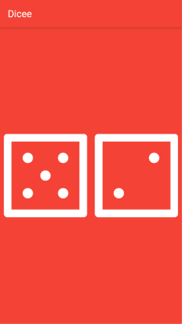
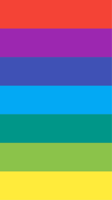
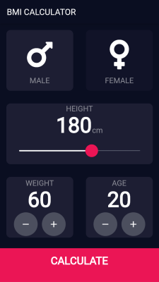
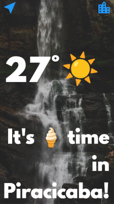

# Flutter Bootcamp Apps

This is the repository for the apps created during the [The Complete Flutter Development Bootcamp with Dart](https://www.udemy.com/course/flutter-bootcamp-with-dart/) taught by [The App Brewery](https://github.com/londonappbrewery).

## I am Rich

This is the very first app build, it shows how Flutter apps are structured, some concepts of the `MaterialApp`, `Scaffold` and `Image` widgets. It also convers assets and app icons.

## Mi Card

A business card as an app. This app covers some concepts of layout (columns and rows), custom fonts, Material icons and text styling.

## Dicee

A dice rolling app. This app covers the concept of stateless and stateful widgets.

## Xylophone

A music app. This app covers the concept of Flutter packages.

This app uses the [audioplayers](https://pub.dev/packages/audioplayers) package.

## Quizzler

A quiz app. This app covers some Object Oriented Programming concepts with Dart and code organization.

> During the course it was suggested to use the [rflutter_alert](https://pub.dev/packages/rflutter_alert) package, but I decided to use the native `AlertDialog` class

## Destini

A choose your own adventure game. This app is really similar to `Quizzler`, but it was made as a challenge instead of a step-by-step guide.

## BMI Calculator

An app that calculates your BMI. This app covers some code organization, Dart concepts, and widget design and refactoring.

> This project was based on the [Ruben Vaalt design](https://dribbble.com/shots/4585382-Simple-BMI-Calculator)

 

## Clima

A weather app. This apps covers more Dart concepts, networking and also navigation (which include passing data between screens).

 
